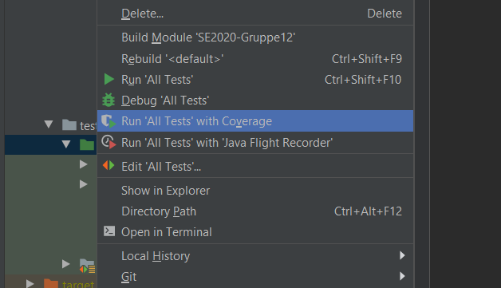

# SE2020-Gruppe12

# Manual

## Dokumentasjon
Man kan finne dokumentasjonen til systemet ligger i mappen som heter documentation, filen heter prosjektdok.pdf.
Man kan finne individuelle evalueringer i mappen som heter individuell_evaluering, denne mappen ligger i documentation-mappen.

## Innstallasjon
For å bygge og kjøre programmet, høyre-klikk mappen og velg å åpne som et intellij prosjekt, eller åpne intelliJ og trykk på fil, velg åpne mappe prosjekt, velg mappen og last inn prosjektet.  Da vil også alle avhengigheter bli installert, eller det vil komme en installasjonsprompt med beskrivelse iterminalen i intelliJ. Dersom dette skjer, må man fullføre installasjonen som står beskrevet i terminalen.  Deretter trykker man på den grønne hammeren i høyere hjørnet eller trykker ctrl + F9 for å bygge programmet. Om det fortsatt ikke kjører, last inn maven avhengigheter på nytt ved å trykke på søkeknappen i høyre hjørne av intelliJ, skriv maven, og trykk reload maven dependencies.

## Bruksmanual
For å starte programmet velg main klassen i src mappen, velg så main metoden og trykk grønn pil ved siden av Public Class Main, for å kjøre run configuration trykk på add configuration, trykk så på application og velg run. Trykk shift + F10, eller grønn pil ved siden av run configuration.  Da vil javalin kjøre i konsollen i intellij, og det åpnes en port til http://localhost:7000/.

Når man har kommet inn til http://localhost:7000/ blir man presentert med tre knapper: En for bruker, en for corporation og en for admin. Bruker-knappen og corporation-knappen fungerer foreløpig helt likt og leder til oversikten av parkeringsplasser der alle tilgjengelige plasser vises. Derfra kan bruker trykke seg inn på en spesifikk parkeringsplass, og videre trykke seg inn til bestillings-siden, fylle ut skjemaene, og trykke submit knappen for å bestille. Da skal parkeringsplassen dukke opp i “My parking spots” på bunnen av siden der det står reservasjoner.

Inne på denne siden kan brukeren opprette parkeringsplasser de ønsker å leie ut ved å trykke på “Create new parking spot”-knappen der de tas til et utfyllingsskjema. Dersom skjemaet ikke er tilstrekkelig utfylt vil en feilmelding vises med all info som er nødvendig i skjemaet. Når skjema er riktig utfylt kan man trykke submit knappen, og den nye parkeringsplassen vil umiddelbart bli lagt ut til både hovedoversikten og til “My parking spots”-siden. Foreløpig i prototypen, fungerer corporation-brukeren på lik linje som bruker-typen.

Dersom man trykker admin-typen kommer man til en oversikt over brukere, parkeringsplasser, poster og reservasjoner. Admin kan suspendere eller slette kontoer, og i tillegg slette parkeringsplasser, poster og reservasjoner.

## Kjøre tester
For ̊a kjøre testene må man åpne test-mappen i intelliJ og høyre-klikke på den grønne java-mappen og velge Run ‘All Tests’ With Coverage. Da kjører testene og man kan se andelen av programmet der det er test-dekning.

Man bør ikke gjøre endringer inne i applikasjonen da dette kan medføre feil i kjøring av repositorytester.

Det går ikke å ha to instanser av applikasjonen kjørende samtidig da den vil prøve å opprette en port som allerede eksisterer og tester vil ikke bli kjørt.

